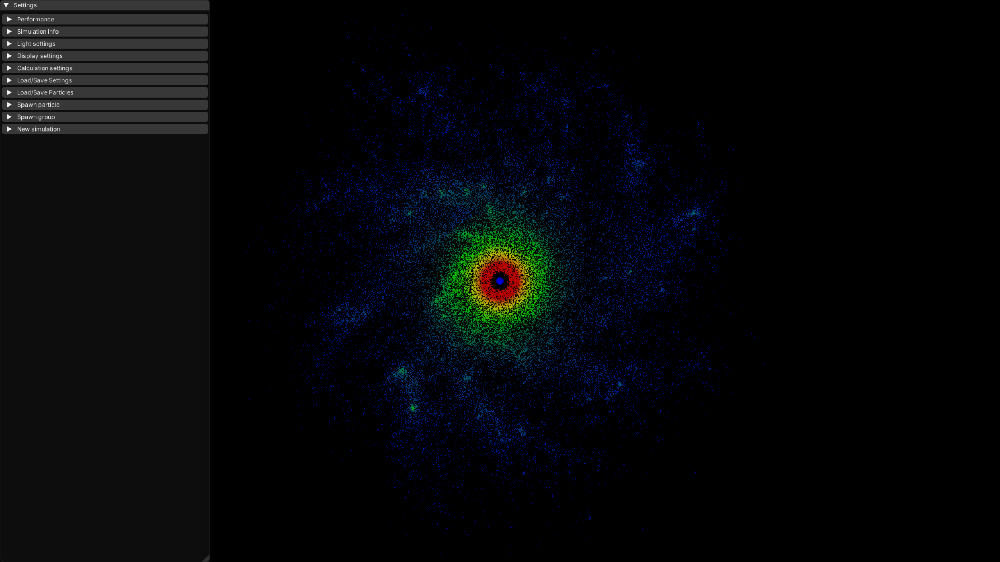
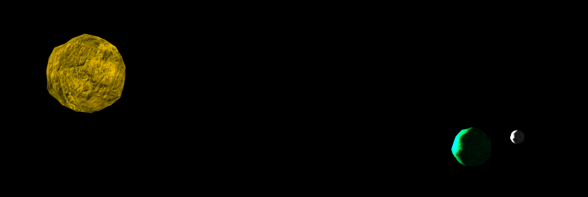
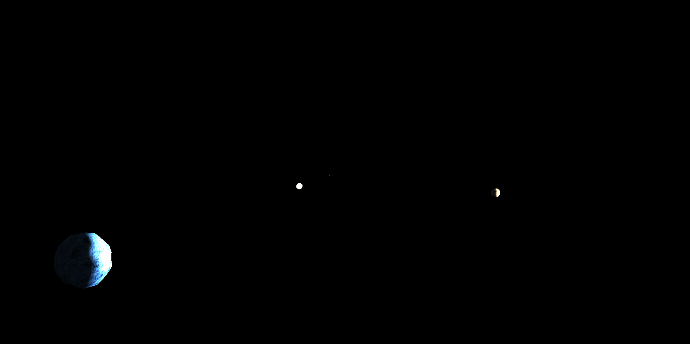
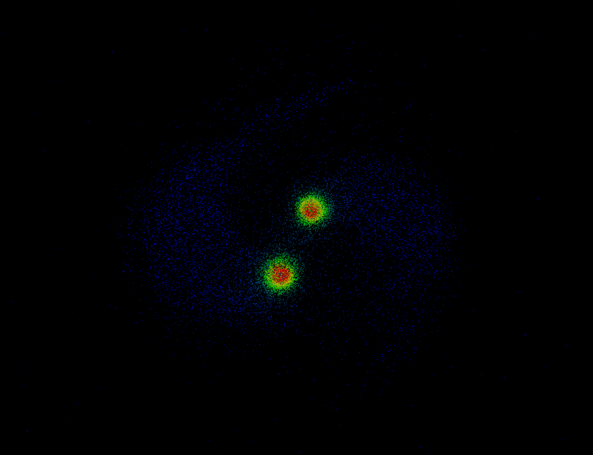
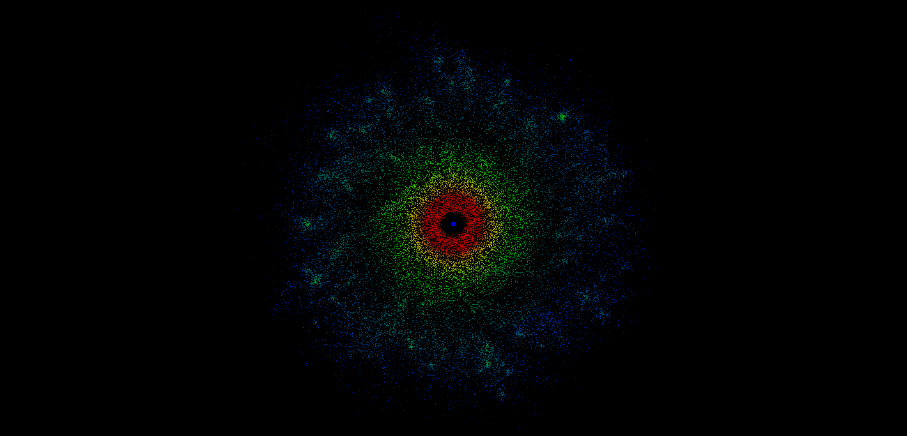
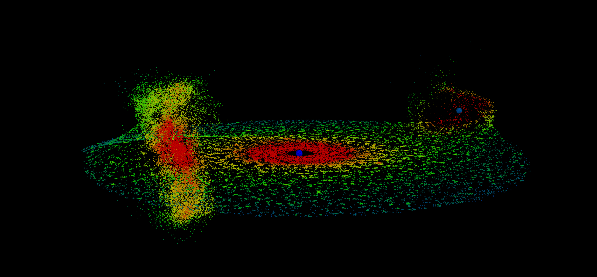
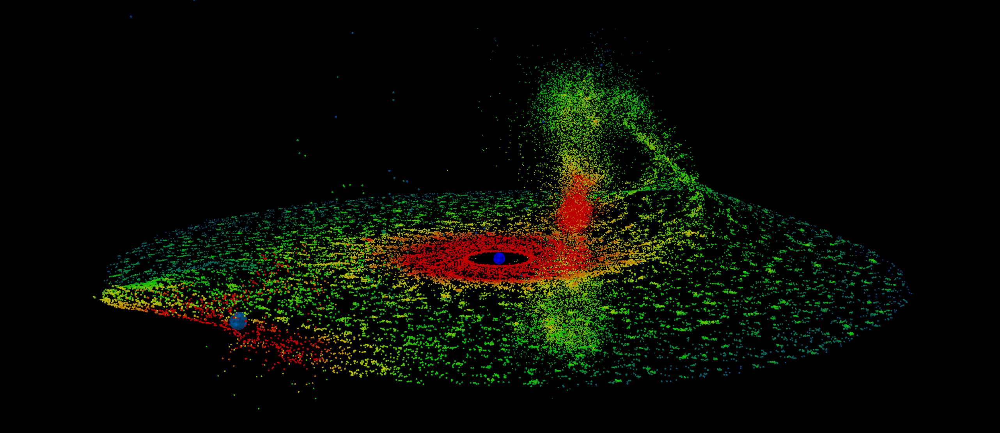

# Gravitron 3D

Gravitron 3D was the thesis work for my Computer Science BSc (alongside with a 50 page documentation that is not present in the repository).

My goal was to create a program that allows for real time simulation of gravtitational forces for a large amount of particles in 3D. I wanted to add a user interface that would be simple enough to allow casual users to create large and complicated systems with just a few clicks. Currently the software supports a lot of different parameter settings to make the simulations (and display) highly customizable. Both the parameters and the simulations themselves can be saved and loaded at any time. The human readable format of the saved data allows for totally custom made simulations (handmade or maybe with a custom python script) to be created and loaded into the program, making possible the display of real actual scientific data (for example a model of the Solar System is present in the program by default).

The software was made with C++ and OpenGL, allowing me to concentrate on memory usage and optimalization. I made several efforts to make the real time simulation possible: I implemented the Barnes-Hut algorithm to approximate gravitational forces quickly but accurately, used multi-threading to lower the time needed for calculations, and used instanced drawing and custom shader programs for efficient rendering.

## Montage

|  |
|:--:| 
| *Screenshot of the screen that the user sees on startup.* |

|  |
|:--:|
| *Screenshot of a simulation loaded from a hand-written input file.* |

|  |
|:--:|
| *Screenshot of the simulation of the Solar System. The planets (left to right): Earth, Saturn, Neptune, Venus.* |

|  |
|:--:|
| *Simulation of a default preset displaying two galaxies colliding.* |

|  |
|:--:|
| *A custom simulation made with the grouped particle spawn options.* |

|  |
|:--:|
| *A complex simulation made with several options, without any custom input files.* |

|  |
|:--:|
| *A different angle of the previously shown custom simulation.* |

## Usage

### Prerequisites:
 - Windows 10 or 11 operating system (might work on other, but the software was only tested on these)
 - GPU (supporting OpenGL 4.6)
 - *Visual Studio Desktop development with C++* downloaded

### Setup:
 1. Download latest release
 2. Extract zip
 3. Launch `Gravitron3D.exe`

